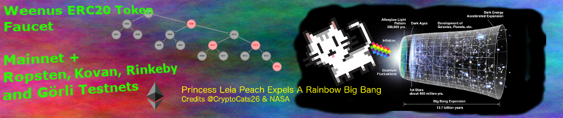
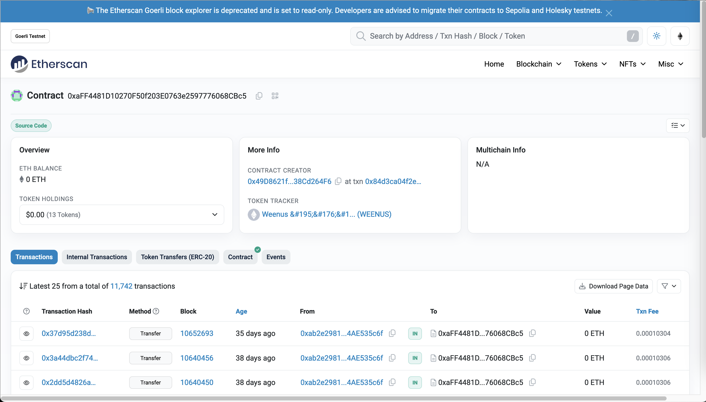
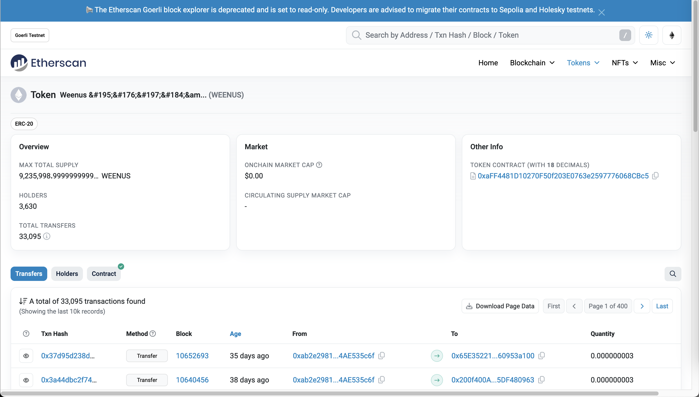
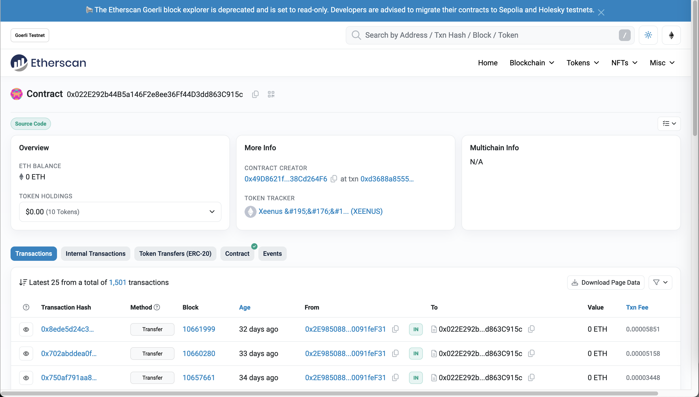
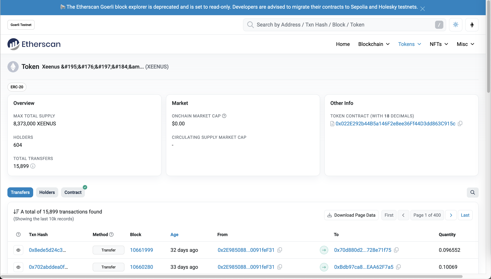
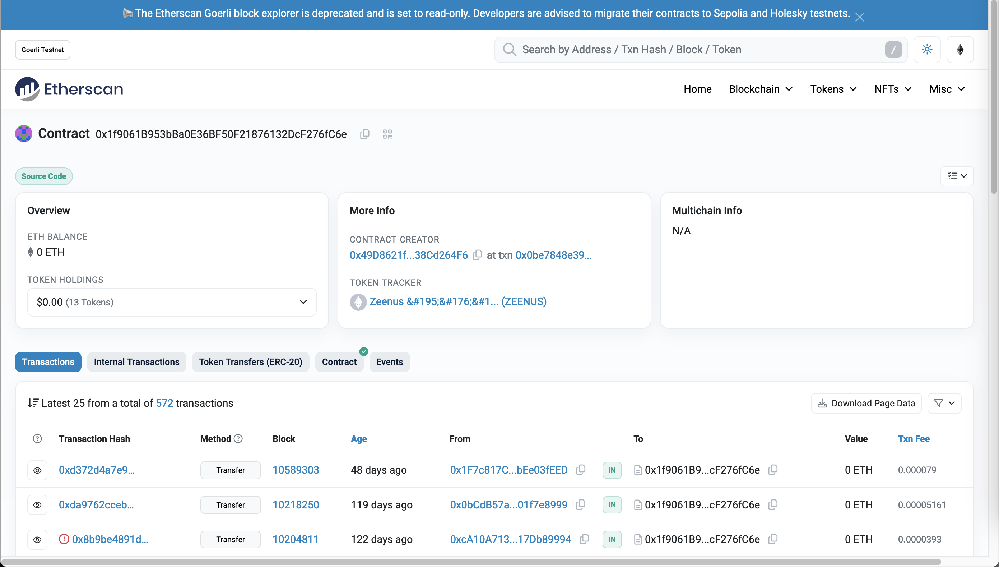

<kbd></kbd>

 

# Weenus 💪 Token Faucet

An ERC20 token faucet on the Ethereum mainnet, some Ethereum L2s, and some testnets.

For Ethereum Layer 2 chains like Arbitrum, Base and Optimism, search for their official bridges or try something lay https://www.layerswap.io/app, to bridge your ETH from Ethereum Mainnet to the Layer 2. Test in small amounts first.

 

Search in your Ethereum blockchain explorer for **WEENUS** (18 decimals), **XEENUS** (18 decimals), **YEENUS** (8 decimals) or **ZEENUS** (0 decimals).

Send a 0 value transaction from your account to the token contract addresses below on your preferred network, and these token contracts will mint 1,000 ERC20 test tokens for your account.

You will need some ethers (ETH) to pay for the network transaction fees. See [Testnet Ether Faucets](#testnet-ether-faucets) below to obtain testnet ethers.

The WETH9 contracts on the ETH and L2 Mainnets are the main WETH9 contracts. The WETH9 contracts on testnets are deployed for testing.

 

Symbol | Decimals | Faucet Drip Rate | [ETH Mainnet](https://etherscan.io/) | [Arbitrum One](https://arbiscan.io/) | [Base Mainnet](https://basescan.org/) | [Linea](https://lineascan.build/) | [Optimism](https://optimistic.etherscan.io/) | [Zora](https://explorer.zora.energy/) | [Sepolia](https://sepolia.etherscan.io/) | [Görli](https://goerli.etherscan.io/) | [Gnosis](https://gnosisscan.io/) | [Polygon(mumbai)](https://mumbai.polygonscan.com/)
:----- | --------:| ----------------:|:------- |:------- |:------- |:------- |:------- |:------- |:------- |:------- |:------- |:-------
[WEENUS](contracts/WeenusToken.sol) | 18 | 1,000 | [0x2823589A](https://etherscan.io/address/0x2823589Ae095D99bD64dEeA80B4690313e2fB519#code) | [0x429106bA](https://arbiscan.io/address/0x429106bAb5981ABb59094b9780cb731Cf1dC16Ad#code) | [0x83377ea9](https://basescan.org/address/0x83377ea907a08baC9320cE6330993EcabBB48578#code) | [0x9C4B276d](https://lineascan.build/address/0x9C4B276d8C6CDa3C2E2E6401f4a502c1E15847E9#code) | [0x07391dbE](https://optimistic.etherscan.io/address/0x07391dbE03e7a0DEa0fce6699500da081537B6c3#code) | [0x9C4B276d](https://explorer.zora.energy/address/0x9C4B276d8C6CDa3C2E2E6401f4a502c1E15847E9?tab=contract) | [0x7439E9Bb](https://sepolia.etherscan.io/address/0x7439E9Bb6D8a84dd3A23fe621A30F95403F87fB9#code) | [0xaFF4481D](https://goerli.etherscan.io/address/0xaFF4481D10270F50f203E0763e2597776068CBc5#code) | [0xE6421E9a](https://gnosisscan.io/address/0xE6421E9aF92aca6a81C9fD0BAbacE4a9c5691c60/contracts) | [0xB293DfbD](https://mumbai.polygonscan.com/address/0xB293DfbDAfdE43cd79B54F98214402ffa895d056)
[XEENUS](contracts/XeenusToken.sol) | 18 | 1,000 | [0xeEf5E2d8](https://etherscan.io/address/0xeEf5E2d8255E973d587217f9509B416b41CA5870#code) | [0x66fa9680](https://arbiscan.io/address/0x66fa96804A82034Dd7C44aF5376eEd7207861efd#code) | [0x07391dbe](https://basescan.org/address/0x07391dbe03e7a0dea0fce6699500da081537b6c3#code) | [0x429106bA](https://lineascan.build/address/0x429106bAb5981ABb59094b9780cb731Cf1dC16Ad#code) | [0x5A4Fc443](https://optimistic.etherscan.io/address/0x5A4Fc44325aa235B81aD60c60444F515fD418436#code) | [Zora](zora) | [0xc21d9767](https://sepolia.etherscan.io/address/0xc21d97673B9E0B3AA53a06439F71fDc1facE393B#code) | [0x022E292b](https://goerli.etherscan.io/address/0x022E292b44B5a146F2e8ee36Ff44D3dd863C915c#code) | [0xB6D06c9b](https://blockscout.com/poa/xdai/address/0xB6D06c9b5C4a65f389796CB713D04ac8Da6fAA01/contracts) | [0x2b3Ea076](https://mumbai.polygonscan.com/address/0x2b3Ea07688fc89cf5cD752f61D287C1570379538)
[YEENUS](contracts/YeenusToken.sol) |  8 | 1,000 | [0x187E63F9](https://etherscan.io/address/0x187E63F9eBA692A0ac98d3edE6fEb870AF0079e1#code) | [0x83377ea9](https://arbiscan.io/address/0x83377ea907a08baC9320cE6330993EcabBB48578#code) | [0x5A4Fc443](https://basescan.org/address/0x5A4Fc44325aa235B81aD60c60444F515fD418436#code) | [0x66fa9680](https://lineascan.build/address/0x66fa96804A82034Dd7C44aF5376eEd7207861efd#code) | [0x74C2A141](https://optimistic.etherscan.io/address/0x74C2A14172cF17E8E9afcB32bB1517c4D8f3BB43#code) | [Zora](zora) | [0x93fCA4c6](https://sepolia.etherscan.io/address/0x93fCA4c6E2525C09c95269055B46f16b1459BF9d#code) | [0xc6fDe3FD](https://goerli.etherscan.io/address/0xc6fDe3FD2Cc2b173aEC24cc3f267cb3Cd78a26B7#code) | [0x0257f5d2](https://blockscout.com/poa/xdai/address/0x0257f5d2f23E41aB39F6016BF3B0010955E5F596/contracts) | [0x0e427E5a](https://mumbai.polygonscan.com/address/0x0e427E5aa094A5b7ab455383Df2C56Dae53612B0)
[ZEENUS](contracts/ZeenusToken.sol) |  0 | 1,000 | [0x0693c3a7](https://etherscan.io/address/0x0693c3a780A0a757E803a4BD76bCf43d438f8806#code) | [0x07391dbE](https://arbiscan.io/address/0x07391dbE03e7a0DEa0fce6699500da081537B6c3#code) | [0x74C2A141](https://basescan.org/address/0x74C2A14172cF17E8E9afcB32bB1517c4D8f3BB43#code) | [ 0x83377ea9](https://lineascan.build/address/0x83377ea907a08baC9320cE6330993EcabBB48578#code) | [0xb549ea68](https://optimistic.etherscan.io/address/0xb549ea689412EdF64d02Ad09f81c2e4A99faDC9C#code) | [Zora](zora) | [0xe9EF74A6](https://sepolia.etherscan.io/address/0xe9EF74A6568E9f0e42a587C9363C9BcC582dcC6c#code) | [0x1f9061B9](https://goerli.etherscan.io/address/0x1f9061B953bBa0E36BF50F21876132DcF276fC6e#code) | [0x81F4Ce55](https://blockscout.com/poa/xdai/address/0x81F4Ce556E4b47748ad2Ab8878FeE5054CbAB7a2/contracts) | [0x9B20B6C3](https://mumbai.polygonscan.com/address/0x9B20B6C3A60C7B5740d62A3Dcda3713Cb5435e6D)
[WETH9](https://etherscan.io/address/0xC02aaA39b223FE8D0A0e5C4F27eAD9083C756Cc2#code) | 18 | Send ETH | [0xC02aaA39](https://etherscan.io/address/0xC02aaA39b223FE8D0A0e5C4F27eAD9083C756Cc2#code) | [0x82aF4944](https://arbiscan.io/address/0x82aF49447D8a07e3bd95BD0d56f35241523fBab1#code) | [0x42000000](https://basescan.org/address/0x4200000000000000000000000000000000000006#code) | [0xe5D7C2a4](https://lineascan.build/address/0xe5D7C2a44FfDDf6b295A15c148167daaAf5Cf34f#code) | [0x42000000](https://optimistic.etherscan.io/token/0x4200000000000000000000000000000000000006#code) | [0x42000000](https://explorer.zora.energy/0x4200000000000000000000000000000000000006#code) | [0x07391dbE](https://sepolia.etherscan.io/address/0x07391dbE03e7a0DEa0fce6699500da081537B6c3#code) | | |

 

# Testnet Ether Faucets

Check [https://ethereum.org/en/developers/docs/networks/#which-testnet-should-i-use?](https://ethereum.org/en/developers/docs/networks/#which-testnet-should-i-use%3F) for the latest information on testnet faucets.

Testnet   | Explorers                     | Testnet ETH Faucets
:-------- |:----------------------------- |:-------------------------
Polygon(mumbai)     | https://mumbai.polygonscan.com/  | https://faucet.polygon.technology/

 

# Mainnet xDai Faucet

Mainnet   | Explorers                     | Mainnet xDai Faucets
:-------- |:----------------------------- |:-------------------------
Gnosis   | https://gnosisscan.io/ | [https://gnosisfaucet.com/](https://gnosisfaucet.com/)

 

# Görli Archive At Apr 13 2024

Görli has been deprecated. Here are screenshots of the usage statistics:

 

Please submit PR with updates to the information above.

 

 

Enjoy!

(c) BokkyPooBah / Bok Consulting Pty Ltd - Apr 13 2024. The MIT Licence.
